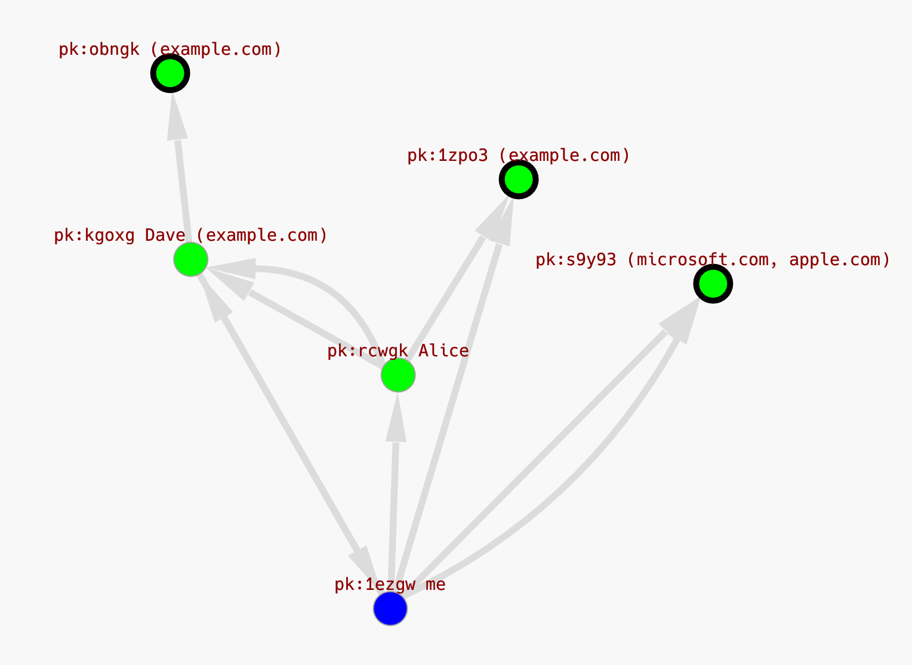
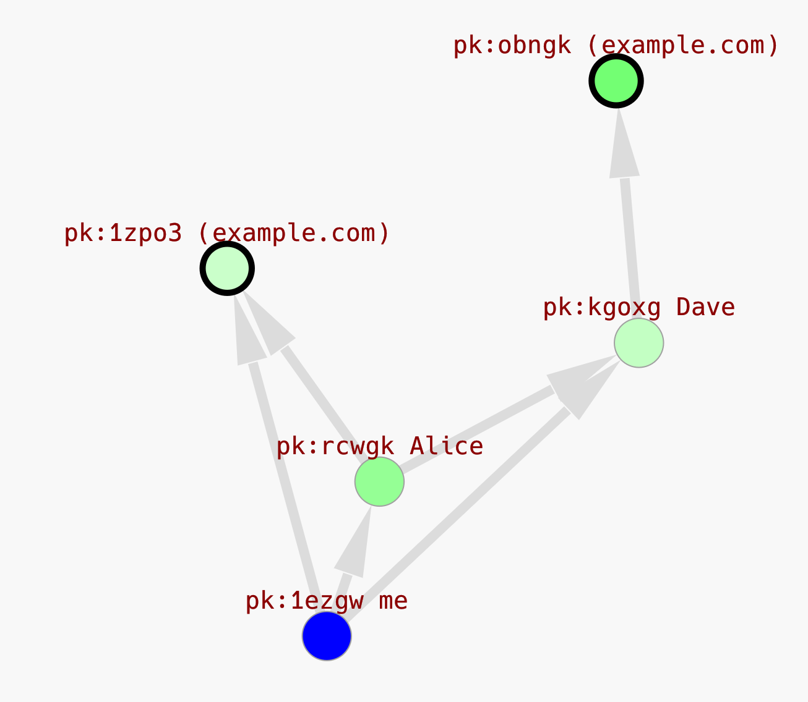

# Simple example

Web of trust with multiple attested domains.



- Our identity: `me`
- We follow: `Alice`, `Dave`, `pk:s9y93`
- Attested domains:
    - example.com: `pk:obngk`, `pk:1zpo3`, `pk:s9y93`, `Dave`
    - microsoft.com: `pk:s9y93`
    - apple.com: `pk:s9y93`


## Commands 

**Show graph in UI**

```bash
➜ cargo run -- -d ./examples/simple ls --ui
```

**Predict domain**

```bash
➜ cargo run -- -d ./examples/simple lookup example.com

Lookup example.com
- pk:1zpo3gfh6657dh8f5rq7z4rzyo3u1tob14r3hcaa6bc9498nbjiy 26.90%
- pk:obngkq5tz5ag4j7jn39zktmq3din6io1h64myiojrrfc18imyu8o 73.10%
```

**Predict domain in UI**

Darker colors equals higher power/probability.

```bash
➜ cargo run -- -d ./examples/simple lookup example.com --ui
```



**Add trust to a pubkey**

Adds pubkey to your list. Trust value must be between -1 and 1 (float).

- `1` means full trust
- `0` means neutral
- `-1` means distrust

Trusting `pk:123456` fully.

```bash

➜ cargo run -- -d ./examples/simple add pk:123456 1  

Add pk:123456 1 None.
Success!
```

**Update trust**

```bash
➜ cargo run -- -d ./examples/simple add pk:123456 0.1  

Add pk:123456 0.1 None.
Success!
```

**Remove trust**

```bash
➜ cargo run -- -d ./examples/simple remove pk:123456 

Remove pk:123456 None from my list
Success!
```

**Attest domain to pubkey**

Attests that `pk:123456` owns `example.com` with a trust value of `1`.


```bash
➜ cargo run -- -d ./examples/simple add pk:123456 1 example.com

Add pk:123456 1 Some("example.com")
Success!
```

**Update attestation**

Update attestation that `pk:123456` owns `example.com` with a trust value of `-0.5`.


```bash
➜ cargo run -- -d ./examples/simple add pk:123456 -- -0.5 example.com

Add pk:123456 -0.5 Some("example.com")
Success!
```

**Remove attestation**

```bash
➜ cargo run -- -d ./examples/simple remove pk:123456 example.com

Remove pk:123456 Some("example.com") from my list
Success!
```

**Show all lists**

```bash
➜ cargo run -- -d ./examples/simple ls

List pk:1ezgw4isz8safcahyt1pa8a5wpk3eyuhm1qpyoeya3pudehhbw9y (me)
- 🅰️  pk:1zpo3gfh6657dh8f5rq7z4rzyo3u1tob14r3hcaa6bc9498nbjiy 1.00 example.com
- 🅰️  pk:s9y93dtpoibsfcnct35onkeyuiup9dfxwpftgerdqd7u84jcmkfy 1.00 apple.com
- 🅰️  pk:s9y93dtpoibsfcnct35onkeyuiup9dfxwpftgerdqd7u84jcmkfy 1.00 microsoft.com
- 📃 pk:rcwgkobba4yupekhzxz6imtkyy1ph33emqt16fw6q6cnnbhdoqso 1.00
- 📃 pk:kgoxg9i5czhqor1h3b35exfq7hfkpgnycush4n9pab9w3s4a3rjy 0.33

List pk:kgoxg9i5czhqor1h3b35exfq7hfkpgnycush4n9pab9w3s4a3rjy (Dave)
- 📃 pk:1ezgw4isz8safcahyt1pa8a5wpk3eyuhm1qpyoeya3pudehhbw9y 1.00
- 🅰️  pk:obngkq5tz5ag4j7jn39zktmq3din6io1h64myiojrrfc18imyu8o 0.50 example.com

List pk:rcwgkobba4yupekhzxz6imtkyy1ph33emqt16fw6q6cnnbhdoqso (Alice)
- 🅰️  pk:kgoxg9i5czhqor1h3b35exfq7hfkpgnycush4n9pab9w3s4a3rjy 0.50 example.com
- 📃 pk:kgoxg9i5czhqor1h3b35exfq7hfkpgnycush4n9pab9w3s4a3rjy 0.33
- 🅰️  pk:1zpo3gfh6657dh8f5rq7z4rzyo3u1tob14r3hcaa6bc9498nbjiy -1.00 example.com
```